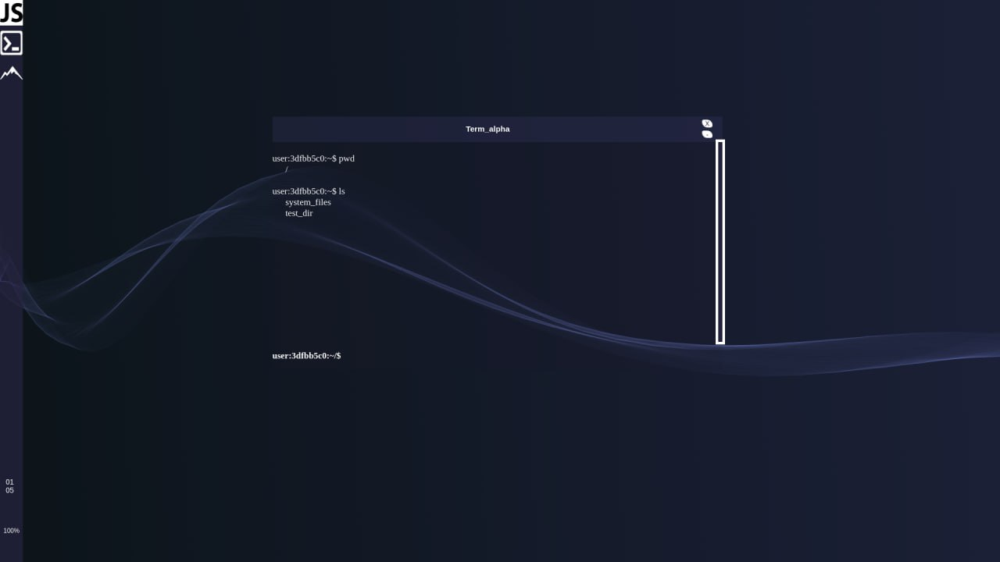

<p align="left">
  <a href="http://nestjs.com/" target="blank"></a>
</p>

<p align="center">
  
</p>


## Description
My Terninal

## Installation

```bash
$ npm install
```

## Running the app

```bash
# development
$ npm run start

# watch mode
$ npm run start:dev

# production mode
$ npm run start:prod
```

## Test

```bash
# unit tests
$ npm run test

# e2e tests
$ npm run test:e2e

# test coverage
$ npm run test:cov
```

## License

Nest is [MIT licensed](LICENSE).
